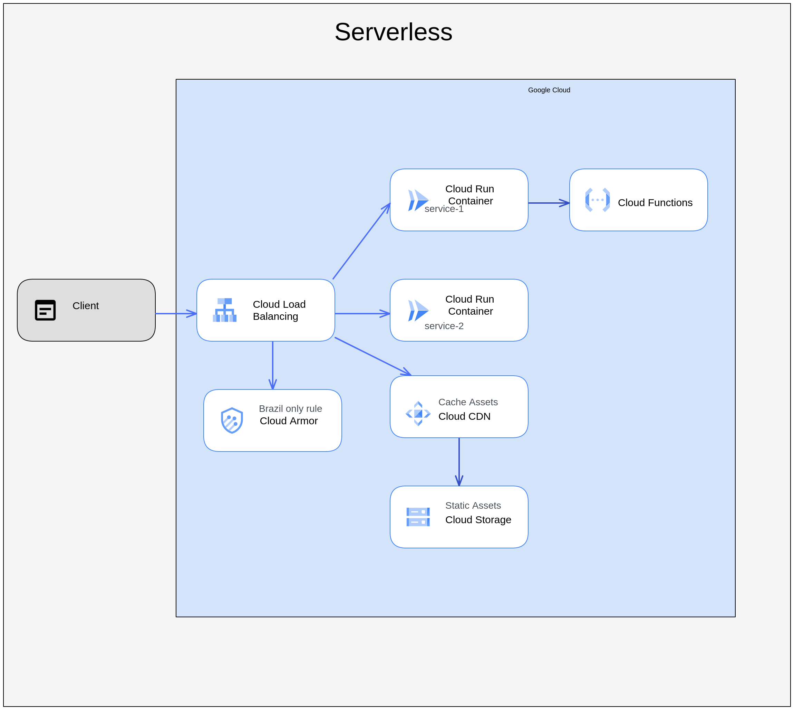

# Serverless + CDN

This project is made up of:
- 1x Cloud Function
- 2x Cloud Run services
- 1x Bucket (to host static files + CDN)
- 1x Public IP address
- 1x Load balancer with Cloud Run services as backends
- 1x Cloud Armor policy to allow connections only from Brazil

## Diagram


## Before you begin
Enable needed APIs
```bash
gcloud services enable run.googleapis.com
gcloud services enable cloudfunctions.googleapis.com
gcloud services enable artifactregistry.googleapis.com
gcloud services enable cloudbuild.googleapis.com
```

## Deploy services

### Cloud Run
```bash
gcloud run deploy service-1 \
  --source cloud-run-app-1 \
  --port 3000 \
  --allow-unauthenticated \
  --region us-east1 \
  --ingress internal-and-cloud-load-balancing
```

```bash
gcloud run deploy service-2 \
  --source cloud-run-app-2 \
  --port 3000 \
  --allow-unauthenticated \
  --region us-east1 \
  --ingress internal-and-cloud-load-balancing
```

### Cloud Function
```bash
gcloud functions deploy func-1 \
  --entry-point entrypoint \
  --source cloud-function-1 \
  --trigger-http \
  --timeout 120 \
  --runtime nodejs16 \
  --max-instances 3 \
  --region us-east1 \
  --allow-unauthenticated
```

## Deploy static files
```bash
BUCKET_NAME=public-files-www-$RANDOM
gsutil mb gs://$BUCKET_NAME 
```

Allow public reading
```bash
gcloud storage buckets add-iam-policy-binding gs://$BUCKET_NAME --member=allUsers --role=roles/storage.objectViewer
```

### Serve static files
Copy HTML files to bucket
```bash
gsutil cp static/*.html gs://$BUCKET_NAME/
```

Serve static files from bucket
```bash
gsutil web set -m index.html -e 404.html gs://$BUCKET_NAME/
```

## Setup Load Balancer
Create a static public ip
```bash
gcloud compute addresses create myapp-lb \
  --network-tier=PREMIUM \
  --ip-version=IPV4 \
  --global
```

Create NEGs
```bash
gcloud compute network-endpoint-groups create service-1-neg \
    --region=us-east1 \
    --network-endpoint-type=serverless  \
    --cloud-run-service=service-1
   
gcloud compute network-endpoint-groups create service-2-neg \
    --region=us-east1 \
    --network-endpoint-type=serverless  \
    --cloud-run-service=service-2
```

Create the backends for each Cloud Run service
```bash
gcloud compute backend-services create service-1-backend \
  --load-balancing-scheme=EXTERNAL_MANAGED \
  --global

gcloud compute backend-services create service-2-backend \
  --load-balancing-scheme=EXTERNAL_MANAGED \
  --global
```

Create the backend for public bucket (with CDN enabled)
```bash
gcloud compute backend-buckets create backend-public-bucket \
    --gcs-bucket-name=$BUCKET_NAME \
    --enable-cdn \
    --cache-mode=CACHE_ALL_STATIC
```

Link the NEG to the backend services created previously
```bash
gcloud compute backend-services add-backend service-1-backend \
  --global \
  --network-endpoint-group=service-1-neg \
  --network-endpoint-group-region=us-east1

gcloud compute backend-services add-backend service-2-backend \
  --global \
  --network-endpoint-group=service-2-neg \
  --network-endpoint-group-region=us-east1

```

Setup URL map
```bash
# Create a map url
gcloud compute url-maps create myapp-url-map \
  --default-backend-bucket backend-public-bucket

# Fill the map url with matchers (check lb/url-map.yaml)
gcloud compute url-maps import myapp-url-map \
   --source lb/url-map.yaml \
   --global

```

Create a proxy
```bash
gcloud compute target-http-proxies create tp-myapp \
  --url-map=myapp-url-map
```

Create a forwarding rule to link all pieces together: Public IP, proxy and all other resources created previously
```bash
gcloud compute forwarding-rules create fr-myapp \
  --load-balancing-scheme=EXTERNAL_MANAGED \
  --network-tier=PREMIUM \
  --address=myapp-lb \
  --target-http-proxy=tp-myapp \
  --global \
  --ports=80
```

Get the IP and test the LB
```bash
gcloud compute addresses list
```

## Cloud Armor

Create a policy
```bash
gcloud compute security-policies create policy-myapp \
    --description "Policy for region deny" \
    --type=CLOUD_ARMOR_EDGE
```

Create a rule to allow request from Brazil
```bash
gcloud compute security-policies rules create 1000 \
    --security-policy policy-myapp \
    --action "allow" \
    --expression "origin.region_code=='BR'"
```

Set deny on default rule
```bash
gcloud compute security-policies rules update 2147483647 \
  --security-policy policy-myapp \
  --action "deny-403"
```

Attach policy to backends
```bash
gcloud compute backend-services update service-1-backend \
  --global \
  --edge-security-policy policy-myapp

gcloud compute backend-services update service-2-backend \
  --global \
  --edge-security-policy policy-myapp
```